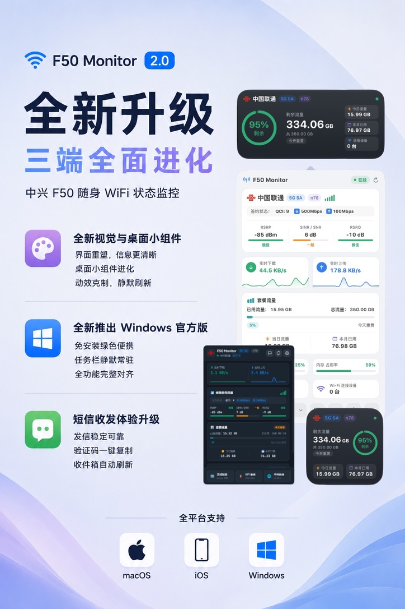

# F50 Monitor ⚡

专为中兴 (ZTE) F50 5G 随身 WiFi (MiFi) 打造的全平台（macOS / iOS / Windows）状态监控与短信管理应用。



> 💡 **提示**：显示全部完整数据（如 CPU/内存占用率、芯片温度及 QCI 签约速率等）需设备安装 **UFI 高级后台 (UFI-TOOLS)**；理论上也适用于其他已安装 UFI-TOOLS 的随身 WiFi 设备。

---

## 📦 各平台下载安装

前往 [GitHub Releases](https://github.com/koldllc/f50-monitor/releases/latest) 下载最新稳定版本（**v2.2.0**）：

| 平台 / 设备 | 推荐下载文件 | 说明 |
| :--- | :--- | :--- |
| 🍏 **macOS (苹果电脑)** | [**`f50-monitor-macos.zip`**](https://github.com/koldllc/f50-monitor/releases/latest) | 菜单栏常驻工具，解压即用（支持 Apple Silicon M 系列芯片与 Intel Mac） |
| 🪟 **Windows (主流电脑)** | [**`f50-monitor-windows-x64.exe`**](https://github.com/koldllc/f50-monitor/releases/latest) | 适用 99% 常见 Windows 电脑（Intel / AMD 处理器），绿色单文件免安装 |
| 🪟 **Windows (ARM 设备)** | [**`f50-monitor-windows-arm64.exe`**](https://github.com/koldllc/f50-monitor/releases/latest) | 适用高通骁龙 ARM 架构 Windows 设备（如 Surface Pro 11 等） |
| 📱 **iOS (iPhone)** | [**`f50-monitor-ios-unsigned.ipa`**](https://github.com/koldllc/f50-monitor/releases/latest) | 未签名 IPA 安装包（支持 Sideloadly / AltStore / TrollStore 等自签安装） |

> 🍏 **macOS 首次运行提示**：若提示“未识别的开发者”，请在 macOS **系统设置 ➔ 隐私与安全性** 中点击“仍要打开”。  
> 📱 **iOS 安装提示**：iOS 安装包为未签名 `.ipa` 文件，可使用 Sideloadly、AltStore、SideStore 或 TrollStore（巨魔）自签安装使用。

---

## ✨ 核心特性

- ⚡ **菜单栏 / 任务栏实时常驻**：支持自定义显示模式（仅图标、实时速率、套餐用量、CPU/内存占用、芯片温度、Wi-Fi 设备数）。
- 📶 **蜂窝信号与频段感知**：实时获取网络制式（5G SA/NSA, 4G LTE）、`B3 + n78` 聚合频段、运营商标志，以及 RSRP、SINR/SNR、RSRQ 信号质量评级。
- 📊 **硬件状态与容错感知**：全面适配 UFI-TOOLS 3.6+ `/api/root_shell` 接口，监控 CPU/内存负载与芯片温度；未就绪或断开时优雅展示 `--` 占位。
- 🌐 **内网穿透与自签名证书信任**：支持直接输入域名直连穿透服务，苹果 ATS 全域网络放开，深度支持自签名 SSL 与各类反向代理。
- 💬 **短信读写与验证码识别**：查看最近短信、未读角标通知提醒，支持应用内直接发送短信及验证码一键复制。
- 🔁 **流量账单日与重置倒计时**：自动识别设备流量清零日（账单日），面板与小组件显示“N 天后重置”。
- 📺 **无线投屏 (scrcpy)**：通过无线 ADB + scrcpy 将设备屏幕镜像到电脑，内置依赖组件一键自动配置。
- 🚪 **登录自启动与自动更新**：支持开机静默启动驻留；macOS 端内置 GitHub Releases 自动增量检测与更新。

---

## 🛠️ 各端本地构建与开发

### 🍏 macOS 版 (SwiftUI)

系统要求：macOS 13.0+ (Ventura 及以上)

```bash
# 编译并打包为 F50 Monitor.app 并自动安装到应用程序目录
./build.sh
```

### 📱 iOS 版 (SwiftUI + WidgetKit)

环境要求：Xcode 16+（iOS 16.0+）

1. 打开 `iOS/F50Monitor-iOS.xcodeproj`。
2. 在 **Signing & Capabilities** 选择你的 Apple ID 团队（免费个人账号即可真机调试）。
3. 选择真机运行；首次安装后在手机 **设置 → 通用 → VPN 与设备管理** 中信任开发者证书。

> 工程由 XcodeGen 维护（`iOS/project.yml`），修改配置后运行 `cd iOS && xcodegen generate` 即可重新生成。

### 🪟 Windows 版 (Tauri 2.0 + Vue 3 + Rust)

环境要求：Node.js 20+、Rust 1.75+、WebView2

```bash
cd windows

# 1. 安装依赖
npm install

# 2. 启动前端 Mock 调试
npm run dev

# 3. 启动桌面端调试
npm run tauri dev

# 4. 构建单文件可执行程序
npm run tauri build -- --no-bundle
```

---

## 📄 许可证

[MIT License](LICENSE)
