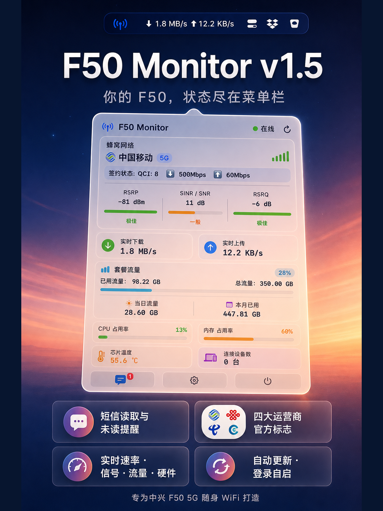

# F50 Monitor ⚡

专为中兴 (ZTE) F50 5G 随身 WiFi (MiFi) 打造的轻量级 macOS 菜单栏状态监控应用。



> 💡 **说明**：显示全部完整数据（如 CPU/内存占用率、芯片温度及 QCI 签约速率等）需要设备安装 **UFI 高级后台 (UFI-TOOLS)**；理论上也适用于其他已安装 UFI 高级后台的随身 WiFi 设备。

## ✨ 特性

- ⚡ **菜单栏实时常驻**：支持自定义显示模式（仅图标、实时速率、CPU/内存占用、芯片温度、连接设备数、完整模式）。
- 📶 **蜂窝信号监控**：实时获取网络制式（5G SA/NSA, 4G LTE）、运营商、信号强度，以及 RSRP、SINR/SNR、RSRQ 信号指标与评级。
- 📊 **硬件状态感知**：监控 CPU 占用率、内存占用率、芯片温度及已连接设备数（需启用扩展 API 支持）。
- 🚀 **QCI & 签约速率**：支持通过 UFI-TOOLS 获取 QoS 及 QCI 签约上下行速率。
- 💬 **短信读写与提醒**：通过 UFI-TOOLS 查看最近短信与未读状态、macOS 通知提醒新短信，并支持直接在 App 内发送短信（含中文/超长短信）。
- 📺 **无线投屏**：通过无线 ADB + scrcpy 将设备屏幕镜像到 Mac，内置依赖组件一键下载配置（无需 Homebrew）。
- 🔁 **流量重置天数提醒**：自动识别设备流量清零日（账单日），面板与菜单栏显示“N 天后重置”。
- 📡 **运营商识别**：支持中国移动、中国联通、中国电信和中国广电的官方标志展示。
- ⚙️ **便捷交互**：一键刷新、一键直达 Web 后台、自定义刷新频率及后台管理密钥。
- 🚪 **登录时启动**：可在设置中启用登录时自动启动，并提示完成必要的系统授权。
- 🔄 **自动更新**：启动时自动检测 GitHub Releases，可自动下载、校验并安装新版本，也可在设置中手动检查。

## 🚧 最新开发状态

当前稳定版本为 **v1.6.0**，已完成：

- 短信发送：内置写短信界面，通过 UFI-TOOLS 直发（含中文/超长短信）。
- 无线投屏：通过 ADB + scrcpy 镜像设备屏幕，支持一键下载配置依赖组件。
- 流量数据对齐设备后台：套餐用量（账单周期）与当日/本月用量（按日查询）分离展示，修复流量显示偏差。
- 流量重置天数提醒：自动识别设备账单日，显示“N 天后重置”。
- 设备短信读取、未读角标与新短信系统通知。
- 四大运营商官方标志适配与网络标识布局优化。
- 登录时自动启动、GitHub Releases 自动更新及 U60 UFI API 连接路径适配。

## 📥 安装与使用

### 直接下载

前往 [Releases](https://github.com/koldllc/f50-monitor/releases) 下载最新版本的 `F50.Monitor.zip`，解压后双击运行即可。

> **提示**：首次运行时若提示“未识别的开发者”，请在 macOS **系统设置 ➔ 隐私与安全性** 中点击“仍要打开”。

### 本地构建

系统要求：macOS 13.0+ (Ventura 及以上)

```bash
# 克隆仓库
git clone https://github.com/koldllc/f50-monitor.git
cd f50-monitor

# 编译并生成 F50 Monitor.app
./build.sh
```

构建完成后，可在当前目录直接运行 `F50 Monitor.app`。

## 📄 许可证

[MIT License](LICENSE)
